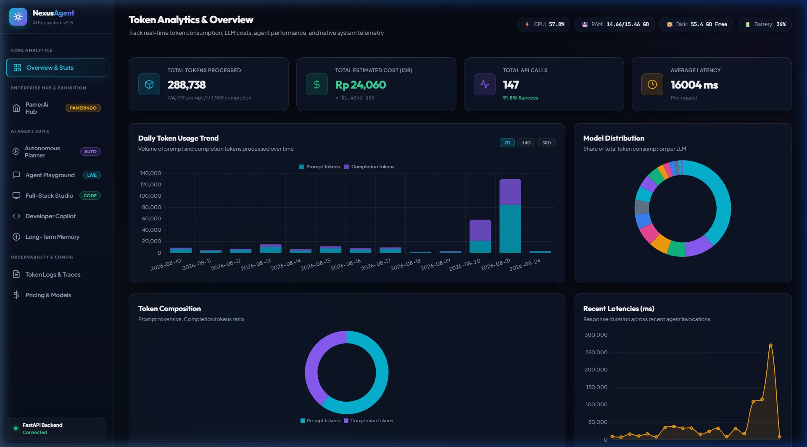
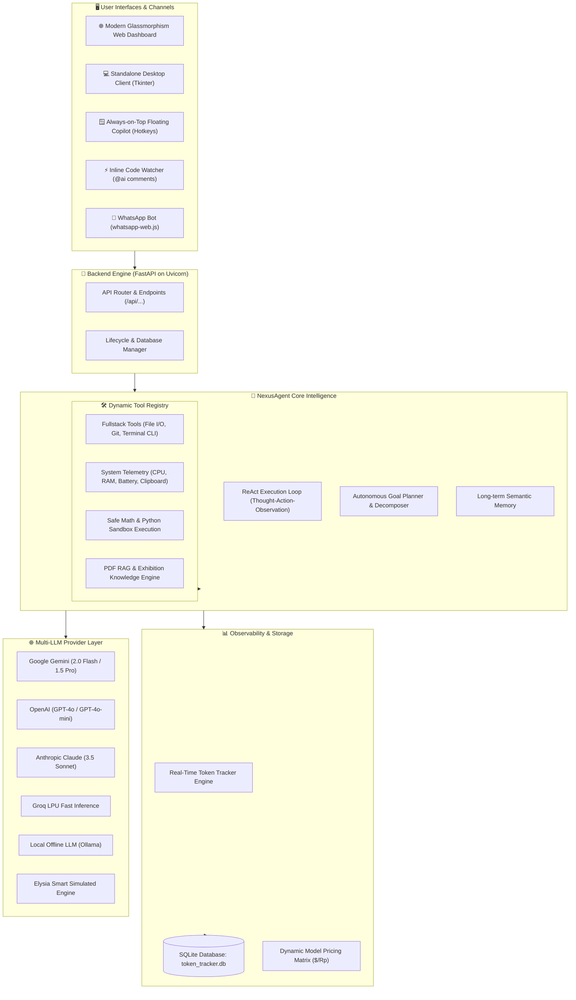

# 🤖 NexusAgent & PamerAi Ecosystem
### *Autonomous ReAct AI Agent, Token & Cost Observability Platform, and Enterprise Exhibition Intelligence Hub*

> **Live Web Platform**: [NexusAgent & PamerAi — Enterprise AI Agent & Token Analytics Platform](http://localhost:8000/)  
> **Interactive Swagger API**: [FastAPI OpenAPI Documentation](http://localhost:8000/docs)



[](http://localhost:8000/)
[](https://python.org)
[](https://fastapi.tiangolo.com)
[](https://sqlite.org)
[](https://nodejs.org)
[](https://github.com/pedroslopez/whatsapp-web.js)
[](LICENSE)

---

## 🌟 Executive Overview (Ringkasan Portofolio)

**NexusAgent & PamerAi Ecosystem** adalah platform kecerdasan buatan (*Autonomous AI Agent Platform*) mutakhir yang menggabungkan kemampuan **ReAct Agent Multi-Step Reasoning**, **Real-Time Token & Cost Observability Analytics**, **Full-Stack Developer & System Copilot**, serta **Enterprise Domain-Specific Assistant (PamerAi)** untuk PT Pamerindo Indonesia (Informa Markets).

Platform ini dirancang secara end-to-end untuk menyelesaikan masalah kompleks dalam:
1. **Automasi Pemrograman & Sistem**: Menjalankan tugas coding, manipulasi file, eksekusi terminal, dan pemantauan hardware laptop secara otonom.
2. **Efisiensi & Transparansi Biaya LLM**: Melacak setiap konsumsi token, latensi inferensi, dan estimasi biaya multi-mata uang ($ USD & Rp IDR) secara transparan melalui dashboard interaktif.
3. **Layanan Pelanggan Industri B2B**: Asisten virtual pameran dagang internasional dengan grounding dokumen (PDF RAG) dan integrasi omnichannel (Web Chat & WhatsApp Bot).

---

## 📑 Daftar Isi

- [Executive Overview](#-executive-overview-ringkasan-portofolio)
- [Arsitektur Sistem](#-arsitektur-sistem)
- [Fitur Utama & Modul](#-fitur-utama--modul)
  - [1. Autonomous ReAct Agent & Multi-Model Engine](#1-autonomous-react-agent--multi-model-engine)
  - [2. Real-Time Token Analytics & Cost Observability Dashboard](#2-real-time-token-analytics--cost-observability-dashboard)
  - [3. Full-Stack Developer Copilot & Inline File Watcher](#3-full-stack-developer-copilot--inline-file-watcher)
  - [4. Desktop Hardware Telemetry & Floating Widget](#4-desktop-hardware-telemetry--floating-widget)
  - [5. PamerAi Exhibition Intelligence Hub & WhatsApp Bot](#5-pamerai-exhibition-intelligence-hub--whatsapp-bot)
- [Tech Stack](#-tech-stack)
- [Struktur Direktori Proyek](#-struktur-direktori-proyek)
- [Instalasi & Panduan Menjalankan](#-instalasi--panduan-menjalankan)
- [Dokumentasi REST API](#-dokumentasi-rest-api)
- [Highlight Portofolio & Pencapaian Teknis](#-highlight-portofolio--pencapaian-teknis)

---

## 🏗 Arsitektur Sistem



---

## 🚀 Fitur Utama & Modul

### 1. Autonomous ReAct Agent & Multi-Model Engine
- **ReAct Reasoning Loop**: Menggunakan paradigma *Reasoning + Acting* (Thought ➡️ Action ➡️ Observation ➡️ Final Answer) untuk pemecahan masalah deterministik.
- **Autonomous Multi-Step Goal Planner (`AutonomousPlanner`)**: Mengurai instruksi tingkat tinggi menjadi sub-tugas independen, melakukan evaluasi bertahap (*self-reflection*), dan memulihkan diri jika terjadi kegagalan eksekusi (*error recovery*).
- **Multi-Provider LLM Gateway**: Terintegrasi fleksibel dengan OpenAI, Google Gemini, Anthropic Claude, Groq, Ollama (Lokal/Offline), dan Elysia Simulated Engine.
- **Long-Term Memory Persistence (`MemoryManager`)**: Mengingat preferensi, fakta penting, dan instruksi pengguna di seluruh sesi percakapan.

### 2. Real-Time Token Analytics & Cost Observability Dashboard
- **Metrik Konsumsi Real-Time**: Melacak Prompt Tokens, Completion Tokens, Total Tokens, dan Latensi (ms) per panggilan API.
- **Estimasi Biaya Multi-Mata Uang**: Konversi biaya otomatis ke USD ($) dan IDR (Rp) berdasarkan katalog harga per 1 juta token yang dapat dikonfigurasi secara dinamis.
- **Visualisasi Data Interaktif**: Dibangun dengan HTML5/Vanilla JS & Chart.js, mencakup tren harian pemakaian token, distribusi pangsa model (*pie chart*), riwayat audit paginasi dengan filter pencarian instan, dan ekspor data.
- **Data Generator**: Fitur *seed simulation* untuk menghasilkan tren data sintetis yang realistis untuk keperluan benchmarking dan demo.

### 3. Full-Stack Developer Copilot & Inline File Watcher
- **Full-Stack Project Management**: Membaca file proyek dengan penomoran baris, menulis/membuat file baru secara presisi, inspeksi struktur folder hierarkis, serta pencarian regex di seluruh repositori.
- **Terminal Execution Whitelist**: Menjalankan perintah pengembangan (`npm`, `pip`, `git`, `docker`, `pytest`) secara aman dari dalam agent.
- **Git Copilot & Diff Summarizer**: Menganalisis perubahan kode lokal (*git diff*), menghasilkan pesan commit otomatis yang mengikuti standar *Conventional Commits*, dan dokumentasi kode.
- **Live Inline File Watcher (`watcher.py`)**: Memantau direktori kerja secara *real-time*. Pengembang cukup menulis komentar seperti `# @ai buat fungsi validasi email` atau `// @ai refactor kode ini`, dan sistem akan langsung menggantinya dengan kode hasil eksekusi AI disertai audio chime notification.

### 4. Desktop Hardware Telemetry & Floating Widget
- **Live Hardware Telemetry (`system_tools.py`)**: Membaca metrik utilitas CPU, alokasi RAM, kapasitas partisi drive, level baterai & status charger, hingga network latency secara live.
- **Clipboard Intelligence**: Sinkronisasi pembacaan dan penulisan teks ke clipboard sistem operasi Windows secara instan.
- **Always-on-Top Floating Copilot (`floating_widget.py`)**: Widget desktop minimalis berbasis Tkinter yang dapat dipanggil kapan saja menggunakan Global Hotkey (`Ctrl + Shift + A` / `Alt + A`).
- **Desktop Client GUI (`gui_app.py`)**: Antarmuka desktop mandiri berdesain dark-mode modern dengan live telemetry ticker dan visualisasi *thought-step*.

### 5. PamerAi Exhibition Intelligence Hub & WhatsApp Bot
- **Domain Knowledge Pamerindo**: Grounding komprehensif untuk 7 klaster industri pameran B2B internasional (Manufaktur, Energi/Mining/OGI, Air/Konstruksi, Makanan & Minuman/FHI, Kecantikan/Cosmobeauté, Laboratorium/Lab Indonesia 2026, Plastik & Karet).
- **PDF RAG & Auto-Extraction**: Ekstraksi cerdas dokumen manual dan jadwal pameran (*Lab Indonesia 2026*) secara langsung dari PDF ke prompt grounding.
- **WhatsApp Bot Integration (`whatsapp-web.js`)**: Bot WhatsApp otomatis bilingual (Indonesia & English) dengan streaming QR Code ke Web Dashboard dan sistem auto-cleaning session lock untuk mencegah *stale lock / EBUSY*.
- **Unified Orchestrator (`run_all.py` / `Jalankan_Semua_Fitur.bat`)**: Menjalankan FastAPI Server, Web Dashboard, dan WhatsApp Bot Engine sekaligus dalam satu proses terpadu tanpa tabrakan port atau terminal berlebih.

---

## 🛠 Tech Stack

| Komponen | Teknologi | Deskripsi |
|---|---|---|
| **Backend Framework** | **Python 3.10+ / FastAPI** | REST API berperforma tinggi dengan asynchronous lifespan & validation via Pydantic v2 |
| **Server Engine** | **Uvicorn** | ASGI server ultra-cepat untuk melayani REST endpoints & file statis |
| **Database & ORM** | **SQLite & SQLAlchemy 2.0** | Penyimpanan lokal persisten untuk token log, memory store, dan katalog harga |
| **Frontend UI** | **Vanilla HTML5, Modern CSS3, JS** | Antarmuka web glassmorphism bebas framework berat, responsive, dan ultra-ringan |
| **Data Visualization** | **Chart.js** | Visualisasi tren deret waktu konsumsi token, pie chart model, dan metrik latensi |
| **Desktop GUI** | **Tkinter & Win32 ctypes API** | Desktop GUI client & Floating Overlay Copilot dengan Global Hotkey Hooks |
| **Hardware Telemetry** | **psutil & Windows WMI** | Monitoring CPU, RAM, Disk, Battery, dan Uptime secara native |
| **WhatsApp Engine** | **Node.js & whatsapp-web.js** | Headless Chromium bridge untuk konektivitas pesan WhatsApp 2 arah |
| **AI / LLM Integration**| **Gemini, OpenAI, Claude, Ollama, Groq, Pollinations** | Multi-provider LLM connectors dengan ReAct reasoning orchestration |

---

## 📂 Struktur Direktori Proyek

```plaintext
AI-Agent/
│
├── agent/                          # 🧠 Modul Inti AI Agent & Tools
│   ├── __init__.py                 # Inisialisasi package
│   ├── engine.py                   # ReAct Agent Engine & Multi-Provider LLM Gateway
│   ├── autonomous.py               # Autonomous Goal Planner & Step Decomposer
│   ├── models.py                   # Pydantic Schemas & Data Transfer Objects (DTO)
│   ├── database.py                 # SQLite Schema, SQLAlchemy Models & Session Engine
│   ├── tracker.py                  # Token Usage & Cost Analytics Tracker
│   ├── memory.py                   # Long-Term Persistent Memory System
│   ├── tools.py                    # Global Tool Registry (Math, Sandbox, HTTP, Search)
│   ├── fullstack_tools.py          # Coding Tools (File I/O, Project Tree, CLI Command)
│   ├── developer_tools.py          # Git Diff, Code Refactor, Commit Generator
│   ├── system_tools.py             # Laptop Hardware Telemetry & Clipboard Manager
│   ├── pamerai.py                  # Pamerindo Knowledge Base & PDF Extractor Hub
│   ├── watcher.py                  # Real-Time Inline Comment (@ai) Watcher Engine
│   ├── floating_widget.py          # Always-on-Top Floating Copilot Desktop Widget
│   └── cli.py                      # Interactive Terminal REPL Client
│
├── Chatbot-Pamerai-main/           # 📱 WhatsApp Bot & Legacy PHP Web Interface
│   ├── data/                       # Dokumen PDF & aset data pameran
│   ├── whatsapp-bot/               # Engine Node.js whatsapp-web.js
│   ├── chat.php                    # Web Chat interface
│   ├── tracker.php                 # PHP Analytics interface
│   └── README.md                   # Dokumentasi sub-modul Pamerai
│
├── static/                         # 🌐 Modern Web Dashboard Frontend
│   ├── index.html                  # Single Page Application (SPA) Dashboard
│   ├── css/                        # Custom Glassmorphism Stylesheet
│   └── js/                         # Dashboard Controller & Chart.js Logic (app.js)
│
├── main.py                         # 🚀 FastAPI Main Application & API Routers
├── run_all.py                      # 🔄 Unified All-in-One Multi-Process Orchestrator
├── gui_app.py                      # 💻 Dark-Themed Desktop Client GUI
├── Jalankan_Semua_Fitur.bat        # ⚡ 1-Click Windows Launcher Script
├── requirements.txt                # Dependensi Python Backend
├── .env.example                    # Template konfigurasi environment variable
└── token_tracker.db                # SQLite database log transaksi token
```

---

## ⚡ Instalasi & Panduan Menjalankan

### 1. Prasyarat Sistem
- **Python 3.10** atau lebih baru (Termasuk dukungan Python 3.14).
- **Node.js v18+** (Wajib jika ingin menyalakan fitur WhatsApp Bot).
- Sistem Operasi: **Windows 10 / 11**, Linux, atau macOS.

### 2. Kloning Repositori & Setup Virtual Environment
```bash
# Clone repositori
git clone https://github.com/username/nexus-agent-pamerai.git
cd nexus-agent-pamerai

# Buat & aktifkan virtual environment (opsional namun disarankan)
python -m venv .venv
.venv\Scripts\activate      # Untuk Windows
# source .venv/bin/activate # Untuk Linux/macOS

# Instalasi dependensi Python
pip install -r requirements.txt
```

### 3. Konfigurasi Environment Variable (`.env`)
Salin file template `.env.example` menjadi `.env`:
```bash
copy .env.example .env
```
Sesuaikan konfigurasi kunci API sesuai provider yang ingin Anda gunakan:
```env
# Server Configuration
HOST=0.0.0.0
PORT=8000
DEFAULT_PROVIDER=elysia       # Opsi: elysia, gemini, openai, anthropic, groq, ollama
DEFAULT_MODEL=elysia-gpt-4o

# LLM API Keys (Opsional - Elysia simulated engine berjalan tanpa API key)
GEMINI_API_KEY=your_gemini_api_key_here
OPENAI_API_KEY=your_openai_api_key_here
ANTHROPIC_API_KEY=your_anthropic_api_key_here
GROQ_API_KEY=your_groq_api_key_here

# Currency Exchange Rate
USD_TO_IDR_RATE=16200.0
```

### 4. Menjalankan Aplikasi

#### 🌟 Opsi 1: Menjalankan Seluruh Ekosistem Sekaligus (1-Click)
Cukup jalankan file batch atau orchestrator Python:
```bash
# Melalui terminal:
python run_all.py

# Atau klik ganda:
Jalankan_Semua_Fitur.bat
```
*Script ini otomatis menginisialisasi SQLite, menyalakan FastAPI Backend pada `http://localhost:8000`, membuka Web Dashboard di browser, dan menyalakan WhatsApp Bot engine di latar belakang.*

#### 🛠 Opsi 2: Menjalankan Komponen Individual

- **Backend API & Web Dashboard**:
  ```bash
  python main.py
  # Buka browser di http://localhost:8000
  ```
- **Desktop Client GUI**:
  ```bash
  python gui_app.py
  ```
- **Always-on-Top Floating Copilot Widget**:
  ```bash
  python agent/floating_widget.py
  # Tekan Ctrl + Shift + A atau Alt + A untuk menampilkan/menyembunyikan
  ```
- **Real-Time Inline File Watcher**:
  ```bash
  python agent/watcher.py
  ```
- **WhatsApp Bot Mandiri**:
  ```bash
  cd Chatbot-Pamerai-main/whatsapp-bot
  npm install
  node index.js
  ```

---

## 📡 Dokumentasi REST API

API didokumentasikan secara otomatis menggunakan OpenAPI / Swagger UI yang dapat diakses di:
👉 **`http://localhost:8000/docs`**

### Ringkasan Endpoint Kunci:

| Method | Endpoint | Deskripsi |
|---|---|---|
| `POST` | `/api/agent/chat` | Eksekusi ReAct agent dengan reasoning steps & tool execution |
| `POST` | `/api/agent/autonomous` | Eksekusi misi otonom bertingkat (*multi-step goal decomposition*) |
| `GET` | `/api/stats/overview` | Ringkasan KPI token (Total Tokens, Biaya USD/IDR, Total Request, Latensi) |
| `GET` | `/api/stats/charts` | Data deret waktu pemakaian token & distribusi model untuk Chart.js |
| `GET` | `/api/logs` | Riwayat log token dengan filter model, status, search, dan pagination |
| `GET` | `/api/system/telemetry` | Telemetri real-time hardware laptop (CPU, RAM, Disk, Baterai, Jaringan) |
| `GET` | `/api/system/clipboard` | Membaca isi teks yang sedang disalin di clipboard laptop |
| `POST` | `/api/system/clipboard` | Menulis teks ke clipboard sistem operasi |
| `GET` | `/api/fullstack/structure`| Menampilkan pohon direktori file proyek |
| `GET` | `/api/fullstack/read` | Membaca isi file proyek dengan penomoran baris |
| `POST` | `/api/fullstack/write` | Menulis atau memodifikasi file proyek |
| `POST` | `/api/fullstack/run` | Menjalankan perintah CLI terminal dalam lingkungan aman |
| `POST` | `/api/pamerai/chat` | Chat interaktif dengan grounding pameran Pamerindo & PDF RAG |
| `GET` | `/api/pamerai/status` | Status sinkronisasi dokumen pameran & status bot WhatsApp |

---

## 🏆 Highlight Portofolio & Pencapaian Teknis

> **📌 Catatan untuk Recruiter / Engineering Hiring Manager:**

1. **Desain Arsitektur Agentik yang Modular & Reaktif**:
   Implementasi ReAct loop mandiri tanpa ketergantungan berlebih pada library wrapper pihak ketiga, memberikan kontrol penuh atas *token budgeting*, *prompt injection handling*, dan *error fallback*.
2. **Observabilitas Finansial LLM Tingkat Enterprise**:
   Mengatasi masalah *hidden cost* pada implementasi AI dengan mengintegrasikan *cost-metering engine* presisi tinggi yang melacak pengeluaran per-sesi, per-tugas, dan per-model secara real-time.
3. **Integrasi Sistem Operasi & Automasi Desktop Mendalam**:
   Memanfaatkan Windows Win32 API, ctypes, dan psutil untuk menghubungkan LLM secara langsung dengan clipboard, hardware sensors, serta file system watcher untuk pengalaman developer yang mulus (*seamless DX*).
4. **Solusi Nyata Skala Industri (B2B Domain-Specific AI)**:
   Menerapkan *Retrieval-Augmented Generation* (RAG) berbasis PDF dan WhatsApp bridge untuk kebutuhan nyata industri pameran B2B (PT Pamerindo Indonesia), membuktikan kesiapan produk untuk lingkungan produksi.

---

---

## 👤 Author & Lead Architect

**Rikkardo L. Tobing**  
*Data & Tech Support Executive | Senior Web Developer*  
Informa Markets Asia · PT Pamerindo Indonesia  

- **Live Platform**: [NexusAgent & PamerAi Dashboard](http://localhost:8000/)
- **REST API Specs**: [FastAPI Swagger UI](http://localhost:8000/docs)
- **Portfolio**: [rikkardochaplin.github.io/portofolio_rikkardo](https://rikkardochaplin.github.io/portofolio_rikkardo/)
- **LinkedIn**: [linkedin.com/in/rikkardo-l-tobing](https://id.linkedin.com/in/rikkardo-l-tobing)
- **GitHub**: [github.com/rikkardochaplin](https://github.com/rikkardochaplin)
- **Email**: [rikkardotobing1@gmail.com](mailto:rikkardotobing1@gmail.com)

---

## 🌐 Related Portfolio Projects

| Project | URL / Technical Doc | Description |
|---|---|---|
| **NexusAgent & PamerAi** | [Project-AI Agent.md](./Project-AI%20Agent.md) • [Live System](http://localhost:8000/) | Autonomous ReAct AI Agent, Real-Time Token Analytics & Cost Observability Platform (FastAPI + SQLite + WhatsApp) |
| **CV Examiner AI Pro** | [Project-CV.md](./Project-CV.md) | AI-powered CV analysis, ATS optimization & career intelligence SaaS platform (GPT-4o + FastAPI + React) |
| **Orion ERP System** | [Project-ERP.md](./Project-ERP.md) | Enterprise manufacturing system & IBM iSeries AS/400 RPG simulator |
| **IoT & Remote Monitor Hub** | [Project-Monitor Tablet.md](./Project-Monitor%20Tablet.md) | Enterprise IoT & Multi-Device Remote Monitoring System for Android & Windows (FastAPI + Kotlin + PyAutoGUI) |
| **PT Pamerindo Indonesia** | [pamerindo.com](https://www.pamerindo.com) | Main B2B trade exhibition organizer website — flagship portal |

---

## 📄 Lisensi
Didistribusikan di bawah lisensi **MIT License**. © 2026 Rikkardo L. Tobing · All rights reserved.

