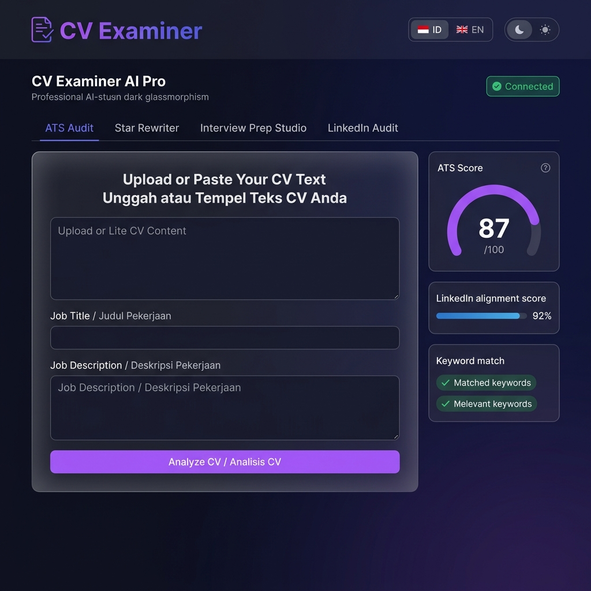

# 🎯 CV Examiner AI Pro

> **AI-Powered CV Analysis, ATS Optimization & Career Intelligence SaaS Platform**
> Enterprise-grade SaaS tool (🇮🇩 Bahasa Indonesia / 🇬🇧 English) powered by **GPT-4o** via Informa AI Engine & AWS Cognito OAuth2.



[](https://reactjs.org/)
[](https://vitejs.dev/)
[](https://fastapi.tiangolo.com/)
[](https://www.python.org/)
[](https://openai.com/)

---

## 📌 Project Overview

**CV Examiner AI Pro** adalah platform SaaS cerdas yang dirancang untuk membantu para profesional dan pencari kerja mengoptimalkan kualitas CV, menguji skor keselarasan ATS, merevisi pencapaian ke format kuantitatif STAR, memprediksi pertanyaan wawancara teknis, serta mengaudit personal branding profil LinkedIn.

---

## ✨ Key Features & Capabilities

- 🔍 **ATS Smart Keyword Audit**: Menganalisis kata kunci pekerjaan target, mendeteksi *missing keywords*, dan menghitung skor keterbacaan ATS (0–100).
- ⭐ **STAR Rewriter Engine**: Memformulasikan poin pengalaman menjadi format **STAR** (*Situation, Task, Action, Result*) dengan metriks kuantitatif.
- 🎤 **AI Interview Prep Studio**: Memprediksi pertanyaan wawancara teknis, perilaku, dan celah CV beserta panduan *Ideal Answer* dan evaluator jawaban langsung.
- 💼 **LinkedIn Profile Audit**: Menguji keselarasan branding antara CV & profil LinkedIn, serta memberikan saran *Headline* & *Bio LinkedIn*.
- 🩹 **CV Weakness Fixer**: Mendeteksi kelemahan tingkat tinggi/sedang pada CV dan memberikan langkah perbaikan konkret (*quick action fix*).
- 📤 **Multi-Format Export**: Ekspor hasil audit komprehensif ke format terstruktur (Plain Text / JSON / PDF ready).
- 🌐 **Bilingual Support & Dark/Light Theme**: Dukungan penuh UI Bahasa Indonesia & English dengan sistem Glassmorphism responsif.

---

## 📸 Screenshots Showcase

| Feature | Screen View |
|---|---|
| **Input Form & Presets** |  |
| **Dashboard Overview** |  |
| **ATS Keyword Audit** |  |
| **LinkedIn Profile Audit** |  |
| **Interview Prep Studio** |  |
| **STAR Rewriter Engine** |  |
| **Weakness Fixer** |  |
| **Export Modal** |  |
| **Light Theme Mode** |  |

---

## 🏗️ System Architecture

```
Project-CV/
├── screenshots/                     # Screenshots aset portofolio (01-09)
├── src/
│   ├── components/
│   │   ├── Header.jsx              # Navigation, status API, switch bahasa & tema
│   │   ├── CVUploadForm.jsx        # Form unggah berkas (PDF/DOCX/TXT) & preset
│   │   ├── AnalysisDashboard.jsx   # Main dashboard & tab navigation orchestrator
│   │   ├── AtsAudit.jsx            # Tab: Audit kata kunci & format ATS
│   │   ├── LinkedInAudit.jsx       # Tab: Uji keselarasan profil LinkedIn
│   │   ├── InterviewPrepStudio.jsx # Tab: Studio latihan & evaluator wawancara
│   │   ├── StarRewriter.jsx        # Tab: Formulasi poin STAR kuantitatif
│   │   ├── WeaknessFixer.jsx       # Tab: Deteksi & perbaikan kelemahan CV
│   │   └── ExportModal.jsx         # Export modal terstruktur
│   ├── utils/
│   │   └── translations.js         # i18n Dictionary (ID / EN)
│   ├── App.jsx                     # Core application state manager
│   ├── index.css                   # Glassmorphism design tokens & styles
│   └── main.jsx                    # Vite entry point
├── backend/
│   ├── server.py                   # FastAPI application & GPT-4o SSE handler
│   └── requirements.txt            # Python backend dependencies
├── capture_screenshots.js          # Automated Puppeteer screenshot generator
├── screenshot.png                  # Main showcase image
├── vite.config.js
└── package.json
```

---

## 🚀 Getting Started

### 1. Prerequisites
- **Node.js**: v18+
- **Python**: v3.11+
- **Informa AI API Credentials**: (Informa Cognito OAuth2 Client ID & Secret)

### 2. Installation & Setup

```bash
# Clone repository
git clone https://github.com/rikkardotobing/project-cv.git
cd project-cv

# Install frontend dependencies
npm install

# Install backend dependencies
cd backend
pip install -r requirements.txt
```

### 3. Environment Configuration

Buat file `.env` pada folder `backend/`:

```env
COGNITO_POOL_DOMAIN=https://idp.dev.ai.informa.com
APP_CLIENT_ID=your_app_client_id
APP_CLIENT_SECRET=your_app_client_secret
HOST_NAME=https://api.stage.ai.informa.com
```

### 4. Running the Application

```bash
# Terminal 1: Launch Backend (FastAPI)
cd backend
python server.py

# Terminal 2: Launch Frontend (Vite Dev Server)
npm run dev
# Access UI at http://localhost:5173
```

---

## 👤 Author & Maintainer

**Rikkardo L. Tobing**  
*Data & Tech Support Executive | Web Developer*  
Informa Markets Asia · PT Pamerindo Indonesia  

- **Portfolio**: [rikkardochaplin.github.io/portofolio_rikkardo](https://rikkardochaplin.github.io/portofolio_rikkardo/)
- **LinkedIn**: [linkedin.com/in/rikkardo-l-tobing](https://id.linkedin.com/in/rikkardo-l-tobing)
- **GitHub**: [github.com/rikkardochaplin](https://github.com/rikkardochaplin)

---

## 🌐 Related Portfolio Projects

| Project | URL / Reference | Description |
|---|---|---|
| **NexusAgent & PamerAi** | [Project-AI Agent.md](./Project-AI%20Agent.md) • [Live System](http://localhost:8000/) | Autonomous ReAct AI Agent, Real-Time Token Analytics & Cost Observability Platform (FastAPI + SQLite + WhatsApp) |
| **CV Examiner AI Pro** | [Project-CV.md](./Project-CV.md) | AI-powered CV analysis, ATS optimization & career intelligence SaaS platform (GPT-4o + FastAPI + React) |
| **Orion ERP System** | [Project-ERP.md](./Project-ERP.md) | Enterprise manufacturing system & IBM iSeries AS/400 RPG simulator |
| **IoT & Remote Monitor Hub** | [Project-Monitor Tablet.md](./Project-Monitor%20Tablet.md) | Enterprise IoT & Multi-Device Remote Monitoring System for Android & Windows (FastAPI + Kotlin + PyAutoGUI) |
| **PT Pamerindo Indonesia** | [pamerindo.com](https://www.pamerindo.com) | Main B2B trade exhibition organizer website — flagship portal |

---

## 📄 License

Developed for internal SaaS deployment at Informa Markets Asia / PT Pamerindo Indonesia.  
© 2026 Rikkardo L. Tobing · All rights reserved.

