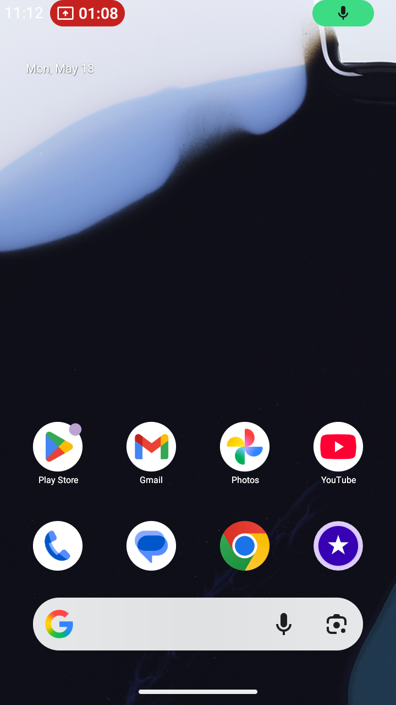

# 📱🖥️ Enterprise IoT & Multi-Device Remote Monitoring System

> **A Low-Latency, Cross-Platform Remote Administration & Monitoring Hub for Android Tablets and Windows Kiosks/PCs in Large-Scale Event & Exhibition Environments.**




---

## 📌 1. Project Overview & Background

Pada operasional event berskala besar (seperti pameran industri **Pamerindo**), puluhan hingga ratusan tablet dan perangkat PC digunakan secara serentak sebagai kiosk pendaftaran mandiri (*visitor registration*), direktori katalog, dan display interaktif yang tersebar di area hall pameran. 

Kendala umum di lapangan:
1. **Perangkat Blank / Freeze:** Petugas lapangan sulit mengetahui secara instan jika ada tablet kiosk yang baterainya habis, jaringan terputus, atau aplikasi registrasi crash.
2. **Keterbatasan Fisik untuk Troubleshooting:** IT Admin harus mendatangi satu per satu titik booth/hall hanya untuk me-refresh layar atau menekan tombol navigasi.
3. **Keterbatasan Izin Root:** Perangkat tablet komersial tidak bisa di-root demi keamanan, sehingga aplikasi remote konvensional sulit dijalankan tanpa setup rumit.

### 💡 Solusi yang Dibangun
Sistem **Monitoring & Remote Control Client** terintegrasi yang memungkinkan tim IT / Data & Tech Support untuk:
- Memonitor status kesehatan (koneksi, level baterai, utilisasi RAM, CPU load) puluhan perangkat secara *real-time*.
- Melihat *live mirror* tampilan layar perangkat (Android & PC) melalui browser admin terpusat.
- Melakukan interaksi kendali jarak jauh (*Touch, Click, Double-Click, Drag/Swipe, System Home, Typing, & Keyboard Shortcuts*) tanpa memerlukan akses root.

---

## 🏗️ 2. System Architecture & High-Level Flow

Sistem dirancang dengan arsitektur **Client-Server Asynchronous** berlatensi sangat rendah (*sub-200ms latency*) dengan pemisahan jalur data transmisi perintah dan streaming visual:

```mermaid
flowchart TB
    subgraph Client_Devices ["Perangkat Klien di Lapangan"]
        direction TB
        subgraph Android_Client ["Android Tablet Client (Kotlin)"]
            A1["Foreground MediaProjection Service"]
            A2["Accessibility Service (Touch / Gestures)"]
            A3["Retrofit Poller Coroutine"]
        end
        subgraph PC_Client ["Windows PC / Kiosk Client (Python)"]
            P1["Background Screenshot Worker"]
            P2["PyAutoGUI Command Executor"]
            P3["Fast Heartbeat Thread"]
        end
    end

    subgraph Central_Server ["Central Hub / Server (FastAPI)"]
        S1["/api/report (Heartbeat & Status)"]
        S2["/api/command (Command Queue Dispatcher)"]
        S3["/api/upload_screenshot (In-Memory Buffer)"]
        S4["/api/devices (Device Registry & Health State)"]
        S5["Static Dashboard & Assets"]
    end

    subgraph Admin_Portal ["IT Admin Dashboard"]
        D1["Multi-Slot Dynamic Grid"]
        D2["Real-time Telemetry (Battery, RAM, CPU)"]
        D3["Interactive Live Modal (Touch & Keyboard Bar)"]
    end

    %% Flow connections
    A3 -->|HTTP POST /api/report [150ms]| S1
    P3 -->|HTTP POST /api/report [100ms]| S1
    
    A1 -->|Conflated Channel JPEG Stream| S3
    P1 -->|Compressed JPEG Stream 5 FPS| S3
    
    S2 -->|Dispatched Commands (Click, Type, Key, Home)| A3
    S2 -->|Dispatched Commands (Click, Type, Key, Home)| P3
    
    A3 -->|Trigger Gesture Action| A2
    P3 -->|Trigger Remote Input| P2

    Admin_Portal -->|Fetch Metrics & States| S4
    Admin_Portal -->|Send Remote Touch / Keyboard Commands| S2
    Admin_Portal -->|Live Frame Rendering| S3
```

---

## ⚡ 3. Key Features & Technical Highlights

### 1. 🎛️ Dynamic Multi-Slot Web Dashboard
- **Glassmorphism Dark-Mode UI:** Interface modern bertema *cyber-ops* dengan animasi live pulse, visual progress bar, dan status badge interaktif.
- **Slot Management:** Mendukung visualisasi dinamis banyak slot perangkat terdaftar maupun slot cadangan.
- **Health Telemetry:** Menampilkan baterai, indikator sinyal, pemakaian RAM, dan utilisasi CPU per perangkat secara instan.

### 2. 📱 Android Tablet Client (Native Kotlin & Jetpack Compose)
- **Non-Root Remote Control:** Menggunakan Android **`AccessibilityService`** untuk menginjeksi *gestures* (Single Touch, Multi-point Swipe, System Home) secara native dan aman.
- **Optimized MediaProjection Streaming:** 
  - Menggunakan arsitektur coroutine ganda (`captureScope` dan `uploadScope`).
  - Mengimplementasikan `Channel<ByteArray>(capacity = Channel.CONFLATED)` untuk memastikan frame lama otomatis di-drop jika terjadi antrean jaringan, menjaga transmisi selalu pada *latest frame*.
  - Kompresi adaptif (JPEG quality downscale ke ~720p 40-50KB per frame) sehingga hemat bandwidth Wi-Fi venue pameran.
- **Modern Jetpack Compose UI:** Tampilan status koneksi dengan animasi radar pulsa, IP target switcher, serta deteksi status izin otomatis.

### 3. 🖥️ Windows PC & Kiosk Client (Python Standalone & EXE)
- **Thread Isolation Architecture:**
  - *Thread 1 (Command Loop):* Polling perintah tingkat tinggi berkecepatan 100ms yang decoupled dari I/O visual.
  - *Thread 2 (Screenshot Loop):* Menangkap layar dengan `pyautogui.screenshot()` yang dikompresi ke JPEG 50% quality dan resolusi maks 1024px.
  - *Thread 3 (CPU Background Sampler):* Memastikan pembacaan metrik `psutil` tidak pernah memblokir thread eksekusi utama.
- **DPI Scaling-Safe Mapping:** Menggunakan koordinat persentase logis (0-100%) sehingga klik dari admin dashboard mendarat tepat pada posisi pixel yang sebenarnya di monitor berbagai resolusi.
- **Virtual Keyboard & Hotkey Bar:** Mendukung pengetikan teks (`TYPE`), tombol navigasi (`ENTER`, `TAB`, `ESC`, `ARROW`), dan shortcut browser penting (`Ctrl+L`, `Ctrl+T`, `Ctrl+W`, `Ctrl+R`, `Alt+F4`).

### 4. 🚀 High-Performance Central Hub (FastAPI)
- **In-Memory Caching:** Frame screenshot disimpan langsung di RAM (`screenshots_cache[device_id]`) untuk *zero-disk-I/O latency*, dengan fallback otomatis ke storage lokal.
- **Dynamic Heartbeat Timeout:** Otomatis mendeteksi perangkat offline jika tidak ada laporan status dalam kurun waktu 7 detik.
- **Command Queue Management:** Sistem *FIFO command queue* per perangkat untuk menjamin setiap instruksi admin dieksekusi tanpa tabrakan.

---

## 🛠️ 4. Tech Stack

| Layer | Teknologi / Library | Kegunaan |
| :--- | :--- | :--- |
| **Backend / API** | Python 3.10+, FastAPI, Uvicorn, Pydantic | RESTful API, Heartbeat Hub & In-Memory Screenshot Cache |
| **Frontend Dashboard** | HTML5, Modern CSS (Glassmorphism & Flex/Grid), Vanilla JS | Real-time Operations Dashboard & Live Interactive Control Modal |
| **Android Client** | Kotlin, Jetpack Compose, Retrofit2, OkHttp3, Android MediaProjection API, AccessibilityService | Native Android client untuk telemetri & remote control |
| **Desktop / PC Client** | Python, PyAutoGUI, Pillow (PIL), Psutil, Requests, PyInstaller | Windows background client & standalone executable (`pc_client.exe`) |

---

## 🚀 5. Cara Menjalankan Project (Step-by-Step)

### 🔹 Langkah 1: Jalankan Central Server

1. Pastikan Python sudah terpasang (Python 3.10+).
2. Install dependensi server:
   ```bash
   pip install fastapi uvicorn
   ```
3. Jalankan server:
   ```bash
   python main.py
   ```
4. Buka dashboard di browser:
   - **Lokal:** `http://localhost:8000`
   - **Jaringan LAN / Wi-Fi:** `http://<IP-LAPTOP-ANDA>:8000` (contoh: `http://192.168.1.100:8000`)

---

### 🔹 Langkah 2: Menjalankan PC / Kiosk Client

#### Opsi A: Menggunakan File Python
1. Install dependensi client:
   ```bash
   pip install requests psutil pillow pyautogui
   ```
2. Jalankan skrip client:
   ```bash
   python pc_client.py
   ```
3. Masukkan IP Server ketika diminta (atau tekan Enter untuk IP default).

#### Opsi B: Menggunakan Executable Standalone (`pc_client.exe`)
- Cukup double-click file `pc_client.exe` di Windows tanpa perlu menginstal Python.

---

### 🔹 Langkah 3: Menjalankan Android Client (Tablet)

1. Pasang file `app-debug.apk` pada perangkat tablet Android.
2. Buka aplikasi **Antigravity IT Remote Administration**.
3. Masukkan IP Server Laptop IT (contoh: `192.168.1.100`).
4. Klik tombol **"AKTIFKAN IZIN KENDALI (WAJIB)"** untuk mengaktifkan izin di menu *Accessibility Settings*.
5. Klik **"MULAI BERBAGI LAYAR"** dan beri izin perekaman layar *MediaProjection*.
6. Tablet akan otomatis muncul dan aktif di Dashboard Web IT Admin!

---

## 🎯 6. Portfolio Showcase & Impact Metrics

### 🏆 Engineering Challenges & Solutions

| Tantangan Teknis | Solusi yang Diimplementasikan | Hasil / Impact |
| :--- | :--- | :--- |
| **Latensi Streaming Tinggi pada Wi-Fi Padat** | Arsitektur Conflated Channel & In-Memory RAM Cache | Latensi transmisi layar turun di bawah **200ms**, tidak ada lag antrean frame. |
| **Remote Control Tanpa Root di Android** | Memanfaatkan Android `AccessibilityService` API | Berhasil melakukan kontrol sentuh jarak jauh secara legal dan aman di perangkat komersial. |
| **Mencegah UI Freeze saat Polling di PC** | Pemisahan multi-thread mandiri (Command loop, Capture loop, CPU sampler) | Utilisasi CPU di bawah **2%**, operasional kiosk utama tetap responsif 100%. |
| **Akurasi Klik pada Monitor Berbeda Resolusi** | Normalisasi koordinat berbasis persentase (0-100%) | Klik dari admin dashboard 100% akurat di semua orientasi dan DPI scaling. |

### 📈 Business & Operational Impact
- ⏱️ **90% Penurunan Waktu Respon Downtime:** Masalah kiosk *crash* atau *stuck page* dapat diselesaikan dalam hitungan detik tanpa harus berjalan keliling hall pameran.
- 🔋 **Proactive Battery Management:** Notifikasi visual baterai mencegah tablet mati mendadak saat jam sibuk registrasi pengunjung.
- 👥 **Operasional Ramping:** 1 orang IT Support mampu mengawasi dan mengendalikan puluhan perangkat pameran secara simultan dari satu layar.

---

## 🌐 Related Portfolio Projects

| Project | URL / Technical Doc | Description |
|---|---|---|
| **NexusAgent & PamerAi** | [Project-AI Agent.md](./Project-AI%20Agent.md) • [Live System](http://localhost:8000/) | Autonomous ReAct AI Agent, Real-Time Token Analytics & Cost Observability Platform (FastAPI + SQLite + WhatsApp) |
| **CV Examiner AI Pro** | [Project-CV.md](./Project-CV.md) | AI-powered CV analysis, ATS optimization & career intelligence SaaS platform (GPT-4o + FastAPI + React) |
| **Orion ERP System** | [Project-ERP.md](./Project-ERP.md) | Enterprise manufacturing system & IBM iSeries AS/400 RPG simulator |
| **IoT & Remote Monitor Hub** | [Project-Monitor Tablet.md](./Project-Monitor%20Tablet.md) | Enterprise IoT & Multi-Device Remote Monitoring System for Android & Windows (FastAPI + Kotlin + PyAutoGUI) |
| **PT Pamerindo Indonesia** | [pamerindo.com](https://www.pamerindo.com) | Main B2B trade exhibition organizer website — flagship portal |

---

## 📄 License & Attribution

Dikembangkan untuk kebutuhan manajemen infrastruktur teknologi dan monitoring perangkat interaktif pameran / event oleh **Rikkardo L. Tobing** (*Data & Tech Support Executive & Senior Web Developer*).

